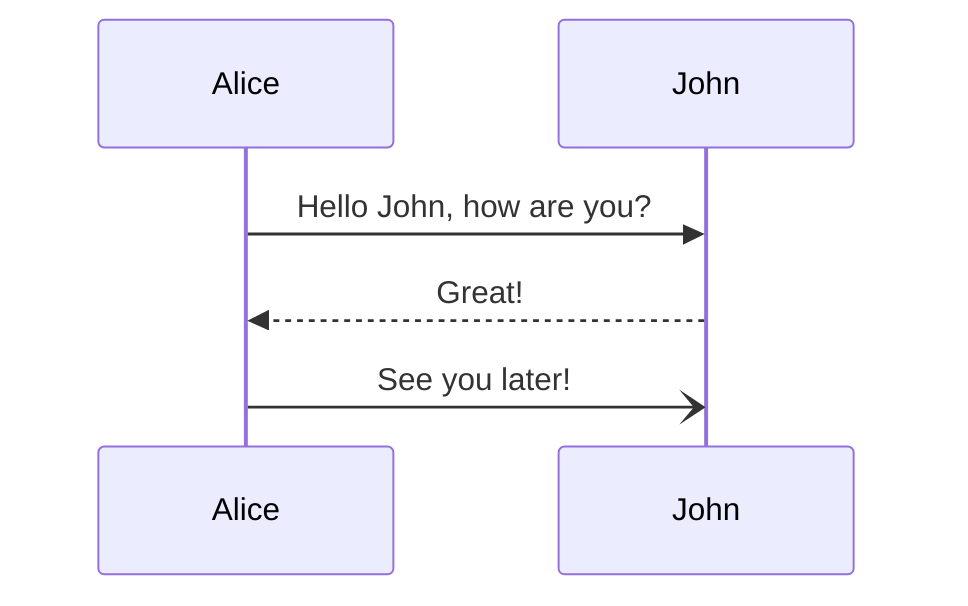
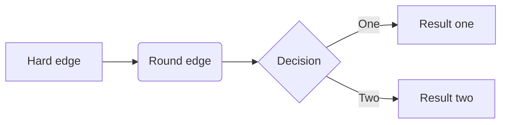
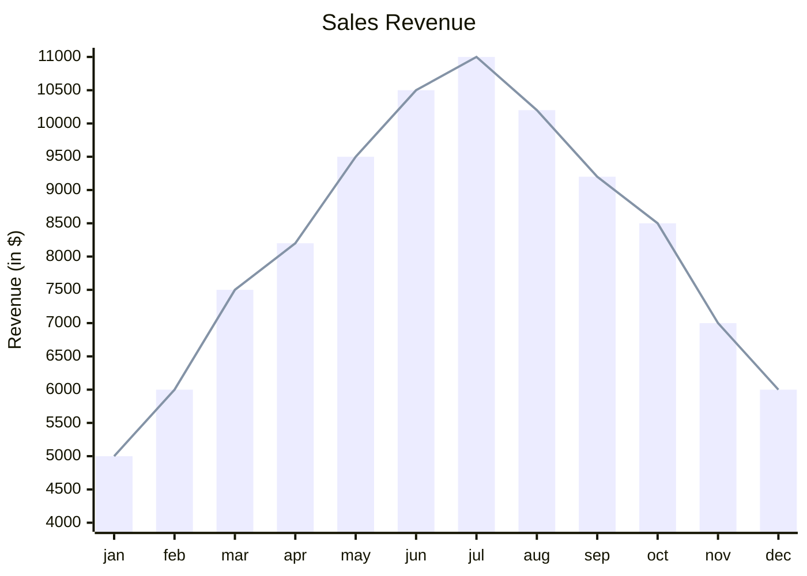
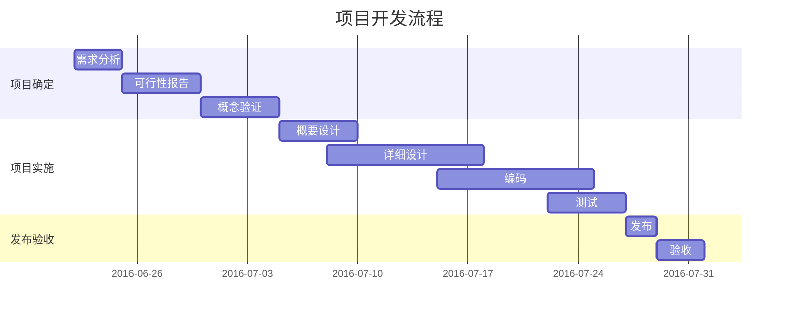
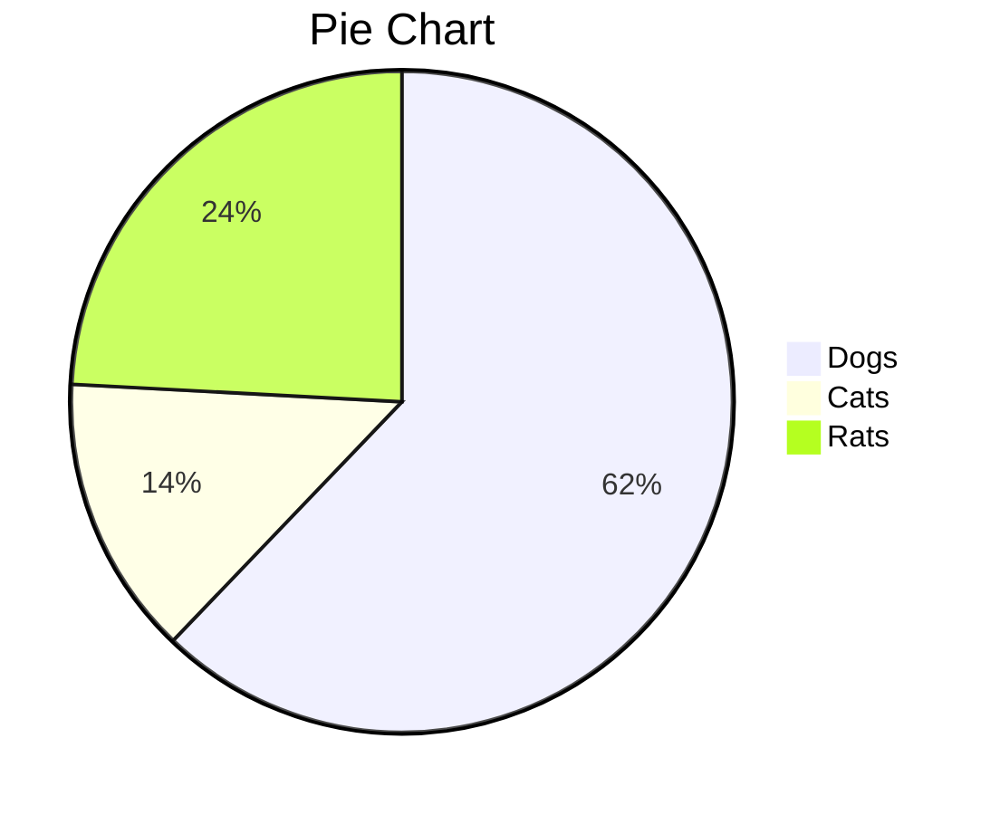

# Markdown 实用语法


---


## 一、什么是 Markdown

Markdown 是一种方便记忆与书写的 **纯文本标记语言**，你可以使用这些标记符号 <font color=red>以最小的输入代价自动生成印刷级排版格式的文档</font>，它在 <font color=red>流畅的书写</font> 和 <font color=red>印刷级阅读体验</font> 之间找到了平衡。常用的标记符号 **不超过十个**，好记好用好效果。

---

## 二、Markdown 编辑器

推荐几款 功能全面、语法兼容、跨平台 的Markdown编辑器：

* [Typora](https://www.typora.io/)（Mac、Win、Linux），所见即所得，首推；
* [MWeb](https://zh.mweb.im/)（Mac、iOS），一款专注于 Markdown 的写作、记笔记和发布软件；
* [MiaoYan](https://github.com/tw93/MiaoYan)（Mac）妙言，PPT模式好用；

---

## 三、Markdown 实用语法

本教程基于流行的 [CommonMark 规范](http://spec.commonmark.org/) 和 [GitHub Flavored Markdown](https://github.github.com/gfm/) (GFM) 语法扩展。

---

### 1. 标题

有多种方式，`#`号方式最多支持 6 级标题，Markdown 语法：

```
# 第一级标题 
## 第二级标题
##### 第五级标题
```

---

### 2. 文字样式

Markdown 语法：

```
*这些文字会生成斜体*
_这些文字会生成斜体_
<u>这些文字会生成下划线</u>

~~这是一段错误的文本~~

**这些文字会生成加粗**
__这些文字会生成加粗__
***这些文字会生成斜体加粗***

==这些文字会生成高亮==
```

---

效果如下：

*这些文字会生成斜体*

_这些文字会生成斜体_

<u>这些文字会生成下划线</u>

~~这是一段错误的文本~~

**这些文字会生成加粗**

__这些文字会生成加粗__

***这些文字会生成斜体加粗***

==这些文字会生成高亮==

---


### 3. 列表
#### 无序列表

使用 `*` 或 `+` 或 `-` 加空格 表示无序列表：

```
- 无序列表项 一
+ 无序列表项 二
* 无序列表项 三
```

效果如下：

- 无序列表项 一
+ 无序列表项 二
* 无序列表项 三

---

#### 有序列表

使用 `数字+点` 加空格 表示有序列表：

```
1. 有序列表项 一
2. 有序列表项 二
3. 有序列表项 三
```

效果如下：

1. 有序列表项 一
2. 有序列表项 二
3. 有序列表项 三

---


### 4. 表格

Markdown 语法：

    | 项目(左对齐) | 价格(居中) | 数量(右对齐) |
    | :--- | :---: | ---: |
    | 计算机 | 1600 | 5 |
    | 手机 | 12 | 12 |
    | 管线 | 1 | 234 |

效果如下：

| 项目(左对齐) | 价格(居中) | 数量(右对齐) |
| :--- | :---: | ---: |
| 计算机 | 1600 | 5 |
| 手机 | 12 | 12 |
| 管线 | 1 | 234 |

---

### 5. 链接

使用 `[描述](链接地址)` ，为文字增加链接：

```
这是去往 [Apple](https://www.apple.com.cn) 的链接。
```

效果如下：

这是去往 [Apple](https://www.apple.com.cn) 的链接。

---

### 6. 图像

使用 `` 插入图像，图片链接地址 可以是本地图片路径，也可以是网络图片url：

```

```

效果如下：


---

### 7. 引用

使用 `>`加空格 表示引用，也可以多个组合：

```
> 野火烧不尽，春风吹又生。
> > 春风吹又生
```

效果如下：

> 野火烧不尽，春风吹又生。
> > 春风吹又生

---

### 8. 代码段

使用一个反引号 \` 前后包围的方式表示代码片段：

```
让我们聊聊 `html`。
```

效果如下：

让我们聊聊 `html`。   

---

### 9. 代码块

使用三个反引号 \`\`\` 前后包围的方式表示代码块。后面跟编程语言可以支持语法高亮显示，支持所有主流编程语言。

JavaScript 示例：

````
```javascript
function fancyAlert(arg) {
  if(arg) {
    $.facebox({div:'#foo'})
  }
}
```
````

效果如下：

```javascript
function fancyAlert(arg) {
	if(arg) {
		$.facebox({div:'#foo'})
	}
}
```

---


### 11. 脚注（Footnote）

标准语法为 `[^keyword]`，keyword随意，保证唯一就行。

Markdown 语法：

```
Markdown到底是什么？[^footnote1]

[^footnote1]: Markdown 是一种方便记忆、书写的**纯文本标记语言**，用户可以使用这些标记符号**以最小的输入代价生成极富表现力的文档**。
```

效果如下：

Markdown到底是什么？[^footnote1]

[^footnote1]: Markdown 是一种方便记忆、书写的**纯文本标记语言**，用户可以使用这些标记符号**以最小的输入代价生成极富表现力的文档**。

---

### 12. 待办事宜（Todo列表）

Markdown 语法：

```
- [x] 支持导出 HTML、PDF、ePub、Word、RTF 等格式文稿；
- [x] 支持 Todo（待办事项）列表功能；
- [x] 支持 Footnote（脚注）功能；
- [x] 支持 高亮代码段；
- [x] 支持 数学公式[^LaTex]；
- [x] 支持 流程图、序列图、甘特图；
- [x] 支持 图床功能；
- [ ] 任务一，未做任务；
    - [ ] 子任务；
```

---

效果如下：

- [x] 支持导出 HTML、PDF、ePub、Word、RTF 等格式文稿；
- [x] 支持 Todo（待办事项）列表功能；
- [x] 支持 Footnote（脚注）功能；
- [x] 支持 高亮代码段；
- [x] 支持 数学公式[^LaTex]；
- [x] 支持 流程图、序列图、甘特图；
- [x] 支持 图床功能；
- [ ] 任务一，未做任务；
    - [ ] 子任务；

---

## 四、HTML 扩展

Markdown 兼容 `HTML` 标签，可以和 `HTML` 混编来拓展更多实用功能。

比如，使用 `<span style="color:red">红色文字</span>` 设置 <span style="color:red">红色文字</span>。

---

### 1. 图像样式

#### 1.1 使用 HTML 标签

使用 `` 标签来显示图片，然后在标签中设置样式。

##### 修改大小

```html


```

---

##### 对齐方式

```html
<div style="text-align: left;">

</div>
```
<!-- 缩放50%且对齐左边 -->

<div style="text-align: left;">

</div>

---

### 2. 表格技巧

<a id="newline"></a>

#### 2.1 表格中换行

在表格单元格里换行可用 HTML 里的 `<br />` 实现。

*示例代码：*

```
| Header1 | Header2                               |
|---------|---------------------------------------|
| item 1  | 1\. one<br /> 2\. two<br /> 3\. three |
```

*示例效果：*

| Header1 | Header2 |
| --- | --- |
| item 1 | 1\. one<br /> 2\. two<br /> 3\. three |

---

<span id="simplification"></span>

#### 2.2 多列表格简写
另外**多列表格**的表示方式还可以简写，<font color=red>可以去掉前后2个竖线`|`</font>

*示例代码：*

```
Header1 | Header2
--- | ---
item 1 | 1\. one
item 2 | 2\. two
```

*示例效果：*

Header1 | Header2
--- | ---
item 1 | 1\. one
item 2 | 2\. two

---

### 3. 任意跳转

1. 设置锚点：在目标位置前一行添加空的 `<a>` 或 `<span>` 标签；
2. 链接锚点：使用 `[显示文字](#锚点id)` 格式设置锚点链接；

*示例代码：*

```html    
<a id="newline"></a>						<!-- 添加在目标位置前一行 -->
<span id="simplification"></span>

点击跳转 [表格中换行](#newline)。		<!-- 设置在链接点击的发起位置 -->
点击跳转 [多列表格简写](#simplification)。
```

*示例效果：*

点击跳转 [表格中换行](#newline)。
点击跳转 [多列表格简写](#simplification)。

---

### 4. iframe 嵌入

*示例代码：*

```html
<iframe height='265' scrolling='no' title='Fancy Animated SVG Menu' src='http://codepen.io/jeangontijo/embed/OxVywj/?height=265&theme-id=0&default-tab=css,result&embed-version=2' frameborder='no' allowtransparency='true' allowfullscreen='true' style='width: 100%;'></iframe>
```

*示例效果：*

<iframe height='265' scrolling='no' title='Fancy Animated SVG Menu' src='http://codepen.io/jeangontijo/embed/OxVywj/?height=265&theme-id=0&default-tab=css,result&embed-version=2' frameborder='no' allowtransparency='true' allowfullscreen='true' style='width: 100%;'></iframe>

---


## 五、数理公式

### 1. 排版与渲染

计算机中，通常用 **LaTeX**、MathML 或 AsciiMath 标记语言来编写数理公式，用 **MathJax** 或 KaTeX 渲染引擎来显示这些公式。

- LaTeX， 一种基于ΤeΧ的排版系统，支持复杂数学公式的编写。详情参考：[LaTeX 基础教程](https://www.latexstudio.net/LearnLaTeX/lesson/01.html)。
- [MathJax](https://github.com/mathjax/MathJax)，一个支持 TeX/LaTeX、MathML 和 AsciiMath 等标记语言的 JavaScript 渲染引擎，用于在HTML中优雅地展示数理公式。
- [KaTeX](https://katex.org/)，另一个 JavaScript 渲染引擎，渲染速度快，但不够全面。

---

### 2. 数学公式

Typora 支持使用 Tex/LaTeX 语法，渲染过程由 MathJax 处理。使用参考：[Math and Academic Functions](https://support.typora.io/Math/) 。

> MiaoYan、MWeb 均支持 LaTeX 语法。

---

**内联公式**：使用 \$ 前后包围方式。

- 用 `$ E=mc^2 $` 表示： $ E=mc^2 $。

**块级公式**：使用 \$\$ 前后包围的方式。

* 用 `$$ \displaystyle x = {-b \pm \sqrt{b^2-4ac} \over 2a} $$` 表示：
  $$ \displaystyle x = {-b \pm \sqrt{b^2-4ac} \over 2a} $$

---

* 用 `$$ f(x_1,x_x,\ldots,x_n) = x_1^2 + x_2^2 + \cdots + x_n^2 $$` 表示：
  $$ f(x_1,x_x,\ldots,x_n) = x_1^2 + x_2^2 + \cdots + x_n^2 $$

---


## 六、绘制图表

### 1. 绘图库

常用的绘图库有 Mermaid、PlantUML、Markmap、flowchart.js、js-sequence-diagrams、Echarts 等。

- [Mermaid](https://mermaid.js.org/)，流行的 JavaScript 绘图库，支持各种UML图和非UML图，使用参考 [Mermaid中文文档](https://mermaid.nodejs.cn/intro/)。
- [PlantUML](https://github.com/plantuml/plantuml)，同上，强大的绘图库，支持各种UML图和非UML图，使用参考 [PlantUML中文文档](https://plantuml.com/zh/)。

---

**Typora**：支持 flowchart.js、js-sequence-diagrams、Mermaid。使用方法见文档 [Typora 绘图](https://support.typora.io/Draw-Diagrams-With-Markdown/)，如果要修改图表样式见 [图表选项](https://support.typora.io/Diagram-Options/)。

**MiaoYan**：支持 Mermaid、PlantUML、Markmap。

**MWeb**：支持 Mermaid、PlantUML、Echarts。

---

### 2. Mermaid 绘图

Mermaid 支持 流程图、序列图、类图、甘特图、饼图、象限图、C4图、思维导图、时间线图、桑基图、框图、数据包图、架构图等…

1. 先声明代码块语言为 `mermaid`；
2. 再声明 mermaid 支持的图类型；
3. 最后描述绘图代码；

---

#### 序列图（时序图）

1.使用 sequenceDiagram：

````

````

---

效果如下：


---

#### 流程图

Mermaid 语法：

````

````

效果如下：


---

#### XY 图

Mermaid 语法：

````

````

---

效果如下：


---

#### 甘特图

Mermaid 语法：

````

````

---

效果如下：


---

#### 饼图

Mermaid 语法：

````

````

---

效果如下：


---

## 七、编辑器特性

### 1. Emoji 表情

- 使用 emoji 简码（编辑器特性）。详情参考 [Emoji 简码表](https://gist.github.com/rxaviers/7360908)。
  - 用 `:smile:` 表示 :smile: 

- 使用 UTF-8 字符集（HTML 扩展）。详情参考 [Emoji Unicode 参考手册](https://www.w3ccoo.com/charsets/ref_emoji.asp)。
  - 十进制：用 `&#128516;` 表示 &#128516; 
  - 十六进制：用 `&#x1F604;` 表示 &#x1F604; 

---

### 2. 跳转标题

使用 `[显示文字](#标题)` 直接链接目标标题，相比前面的 [任意跳转](#3. 任意跳转)，不需要设置锚点。


> [!TIP]
> <!-- NOTE、TIP、IMPORTANT、WARNING、CAUTION -->
> 如果标题重复，则添加从 1 开始的编号后缀，例如用 `[显示文字](#标题-1)` 表示第一个，以此类推。

---

### 4. 自动排版

MiaoYan 支持书写格式自动排版（格式化），快捷键 <kbd>command</kbd> + <kbd>shift</kbd> + <kbd>l</kbd> ；

---


### 5. 幻灯片_演示文稿

#### 幻灯片框架

编辑器本身不支持制作幻灯片演示文稿，但可以借助支持 Markdown 语法的开源框架来实现。

- [reveal.js](https://revealjs.com/markdown/)，一个流行的 HTML 幻灯片框架，能让任何人免费制作功能齐全且精美的演示文稿，[案例展示](https://revealjs.com/?demo)。
  - 基于 reveal.js 的扩展：[reveal-md](https://github.com/webpro/reveal-md)。
- [Slidev](https://github.com/slidevjs/slidev)，为**开发者**打造的极具表现力、灵活性和交互性的幻灯片制作工具，[案例展示](https://sli.dev/demo/starter)。使用参考：[为什么选 Slidev](https://cn.sli.dev/guide/why)。

---

[^LaTeX]: 支持 $LaTeX$ 编辑显示，例如：$\sum_{i=1}^n a_i=0$，访问 [MathJax](http://meta.math.stackexchange.com/questions/5020/mathjax-basic-tutorial-and-quick-reference) 参考更多使用方法。

